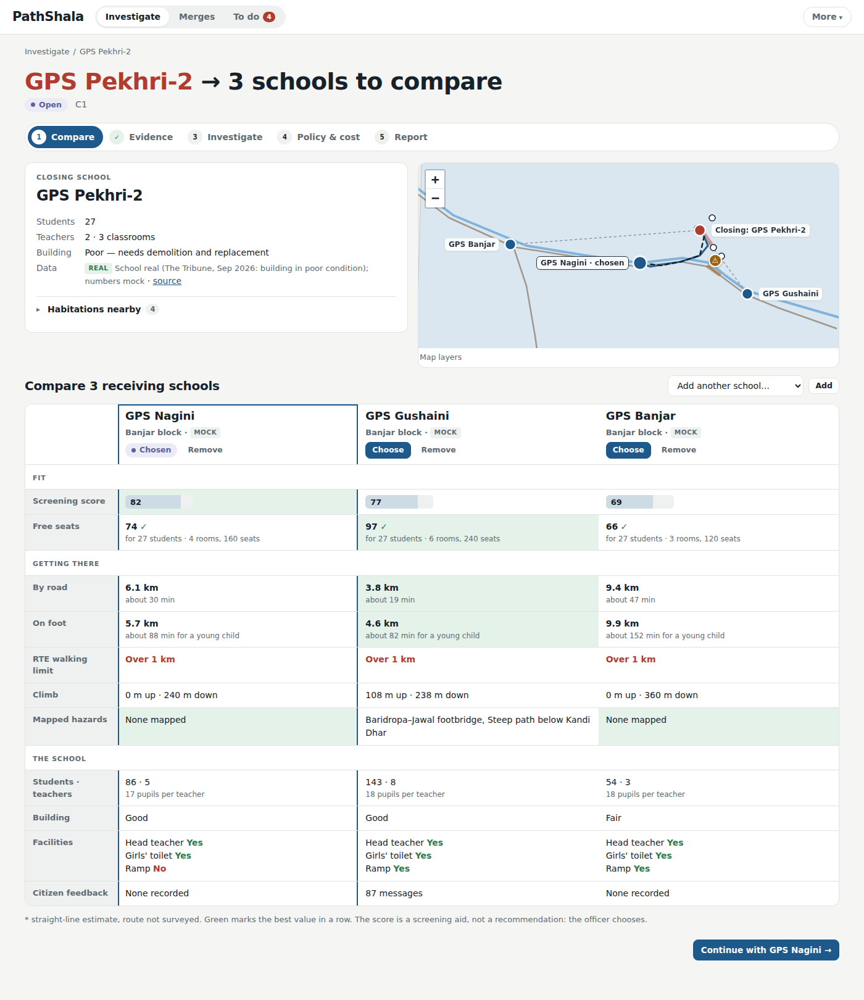

# PathShala

A school-consolidation investigation tool for district education officers in Himachal Pradesh.

1. **Pick one closing school** on the map.
2. **Tick several receiving schools** (two, three or more) and compare them **side by side**: distance and walking time, hazards on the route, free seats, teachers, building, facilities, citizen feedback. Green marks the best value in each row.
3. **Choose one** and investigate it: evidence (route and citizen feedback), agent findings, field questions, policy and cost, and a referenced report that only the officer can approve and submit.

A second half of the app tracks existing merges (success score, problems, field surveys).

Every value on screen has a real source (UDISE+, Routes and Elevation APIs, GIS layers, RTE Rules, Samagra Shiksha norms, precedents) or is labelled synthetic; where there is no data it says **Data unavailable** and nothing is invented. See "Data audit" below.



Built with Vite and vanilla JavaScript on SQLite (sql.js) in the browser, with a clean seam for connecting Gemini later.

## Run it

```bash
npm install
npm run dev          # http://localhost:5173/app.html  (dev entry is app.html)
npm run build        # one self-contained dist/index.html
npm run pages        # build and copy it to ./index.html (what GitHub Pages serves)
npm run preview      # serve dist/ on :4173
```

### Host on GitHub Pages

The repo root already contains a built `index.html`: a single file with the JS, CSS, sql.js WebAssembly and map data inlined
(about 2.9 MB, 1 MB gzipped). In the GitHub repo go to **Settings → Pages → Build and deployment → Deploy from a branch**,
pick the branch and `/ (root)`, and open `https://<user>.github.io/<repo>/`. It also opens by double-clicking `index.html`.
After changing the source, run `npm run pages` and commit the new `index.html`. It makes no network requests except the
optional Google Fonts stylesheet (system fonts are used if that is blocked).

Everything runs in the browser, from that one file: SQLite (WebAssembly, with an asm.js fallback), the rules engine and the agents. The database
is saved to `localStorage` (`pathshala.db.v5`) after every write; **Reset demo** reloads it from `src/db/seed.sql`.

Deploy `dist/` anywhere: `firebase deploy` (see `firebase.json`), or `docker build -t pathshala . && docker run -p 8080:8080 pathshala`
(nginx, works on Cloud Run).

### Tests

```bash
npx playwright install chromium       # once (or set PW_CHROMIUM=/path/to/chromium)
npx playwright test                   # 47 tests: acceptance flow, every button, agents, guardrails, data audit
node tests/gen-fixtures.mjs           # regenerates src/agent/fixtures/C1/*.json
```

`tests/e2e.spec.js` walks the reference investigation (pick a school, tick three receivers, compare, choose, investigate, field answers, cost, report, submit) and saves screenshots to `docs/screens/`. `tests/ui-buttons.spec.js` clicks every control on every page. `tests/agents.spec.js` covers schema validation, fixtures, retrieval, the guardrails in `docs/AGENTS.md` and the data audit.

### Regenerating the data

`npm run seed` runs `data/build_seed.py` (which imports `data/case_data.py`, the Tirthan valley case) and copies the result to
`src/db/seed.sql`. If you change the schema, bump the localStorage key (`STORE` in `src/db/sqlite.js`).

## Architecture

```
                      ┌────────────────────────── browser ───────────────────────────┐
  hash router         │  ui/pages/*  ──renders──►  DOM (same HTML and CSS as prototype) │
  #/  #/case/C1/…     │      │  ▲                                                     │
  #/m/M5 …            │      ▼  │ events {label, tool, input, output, summary}        │
                      │  agent/runner.js ── validates every output (Ajv) ─────────┐   │
                      │      │  calls                                              │   │
                      │      ▼                                                     ▼   │
                      │  agent/provider.js ──► SimulatedProvider ─► agents/*.simulate  │
                      │        (VITE_AGENT_PROVIDER)   GeminiProvider ─► POST /api/agent (stub)
                      │                                   │ tool_call                   │
                      │                                   ▼                             │
                      │  agent/tools.js  (14 tools: async JSON in, JSON out)            │
                      │      │ read-only                                                │
                      │      ▼                                                          │
                      │  db/sqlite.js (sql.js) ◄── case/findings.js (the only writer)   │
                      │      ▲                                                          │
                      │  engine/rules.js, merges.js, evalPair.js (deterministic rules)  │
                      └─────────────────────────────────────────────────────────────────┘
```

```
src/
  main.js            boot: load sql.js and hp.json, open the DB, run the analysis, start the router
  db/                sqlite.js (init, open, save/load, q/q1/run), schema.js (runtime DDL), seed.sql
  engine/            rules.js (checks, plan, questions, verdicts), merges.js, evalPair.js, classify.js
  agent/             agents/ prompts/ schemas/ fixtures/  tools.js plan.js runner.js provider.js validate.js
  retrieval/bm25.js  policy retrieval (BM25)
  case/              analysis.js (routes, hazards, transport, screening), findings.js (repository), draft.js
  ui/                router.js, helpers.js, toast.js, components.js, map/*, pages/*
  styles/app.css     the prototype CSS, verbatim
```

`PLAN.md` maps every prototype function to its module. `NOTES.md` lists prototype bugs that were kept on purpose.

### Routes

`#/` investigate (pick a school) · `#/cases` · `#/case/:id/{compare,evidence,investigate,policy,report}` · `#/merges` · `#/m/:merge` ·
`#/m/:merge/g/:group` · `#/m/:merge/p/:group/:code` · `#/m/:merge/{survey,feedback}` · `#/problems` and `#/surveys` (the To do tabs) · `#/new` ·
`#/s/:school` · `#/inbox` · `#/rules` · `#/sql`

## The agents

Eight agents, specified in `docs/AGENTS.md`, live in `src/agent/agents/`. Each exports
`{ id, systemPrompt, tools, outputSchema, simulate(ctx) }`.

| Agent | Job | Tools | Output schema |
|---|---|---|---|
| Coordinator | merges specialist evidence into findings | (calls the specialists) | Findings |
| Access Analyst | students, routes, terrain, transport | sql_query, school_profile, route_calc, gis_overlay, transport_lookup | EvidenceBundle |
| Community Analyst | feedback themes, recurring concerns, field observations | feedback_search, classify_feedback, recurring_concerns, field_observations | EvidenceBundle |
| Gap Finder | evidence gaps and targeted field questions | evidence_gaps | FieldQuestions |
| Evidence Updater | field answers to evidence and finding statuses | apply_field_answers | EvidenceUpdate |
| Policy Researcher | policy chunks to interventions, with costs | policy_retrieve, cost_calc | Interventions |
| Report Drafter | rationale from case evidence, a reference on every sentence | get_case_evidence, draft_report | Draft |
| Report Critic | checks references, numbers and wording | get_case_evidence | Critique |

The merge-side agents (`mergePlanner`, `successMonitor`, `surveyBuilder`) keep the same shape and stay deterministic.
System prompts are in `src/agent/prompts/*.md`, output schemas (JSON Schema 2020-12) in `src/agent/schemas/*.json`.

**Hard rules, enforced in code and tested:** the LLM never produces numbers or approvals. Costs come only from `cost_calc`
(rules table and the Samagra Shiksha norm). The draft may only use evidence already in the case, and the Report Critic checks
that every sentence has a real reference and every number appears in the evidence. Only the officer approves, selects an
intervention, marks evidence verified or submits (no agent code writes `cases.status` or `reports.approved`). Every agent output is
validated with Ajv; on failure the runner retries once, then falls back to the simulated result and logs it in `case_log`.

### Where to plug in Gemini

1. **`src/agent/provider.js`**: `GeminiProvider.call(agent, ctx)` is a stub with a TODO. `buildRequest()` already builds the
   payload. Choose the provider with `VITE_AGENT_PROVIDER=gemini` (default `simulated`, which reproduces the prototype exactly).
2. **`/api/agent`**: a Cloud Run proxy (Node or Python, Google ADK or plain Vertex AI function calling) that holds the API key.
   Contract:

   ```
   POST /api/agent   { agent, case_id, system, messages, tools: toolSchemas, response_schema }
   ← NDJSON  {"type":"tool_call","name","args","call_id"}   browser runs tools[name](args) on sql.js, POSTs {call_id, output}
   ← NDJSON  {"type":"final","json":{…}}                    validated against response_schema, then written to the DB
   ```

   Use temperature 0.2 for analysts and 0.4 for the Drafter, and log every call. The repository already has a FastAPI Gemini
   proxy in `backend/` (deployed with `render.yaml`) that you can extend with this endpoint.
3. **Retrieval**: `src/retrieval/bm25.js` is BM25 over `policy_chunks`. For LLM mode add embeddings (`policy_vectors`) and
   reciprocal-rank fusion behind the same `policy_retrieve` tool (see `docs/AGENTS.md` section 6).

### Tools

Defined in `src/agent/tools.js`, each as `async (input) => output` over plain JSON. `toolSchemas` holds the same tools in
Gemini function-declaration format (`name`, `description`, `parameters` as JSON Schema). Tools never write to the database.

| Tool | Input | Output |
|---|---|---|
| `sql_query` | `{sql}` single `SELECT`/`WITH` | `{rows}` (rejects writes, multiple statements, unknown tables) |
| `school_profile` | `{school_id}` | school, facts, habitations |
| `nearby_schools` | `{school_id, max_km?}` | `[{school_id, road_km, walk_min, capacity, available, hazards, score, parts, estimated}]` |
| `route_calc` | `{from_id, to_id, mode: walk\|road}` | `{km, minutes, climb_m, descent_m, max_slope_pct, steep_km, profile}`; walking uses Tobler's function × `child_pace` (R13) |
| `gis_overlay` | `{from_id, to_id, route, buffer_m?, layers?}` | mapped bridges, steep paths and landslide zones within 150 m |
| `transport_lookup` | `{habitation_ids?, windows?}` | `{available: false, reason: "Data unavailable…"}`: no timetable source is connected, so this is asked as a field question |
| `feedback_search` | `{school_ids, about_id?, hab_ids?, theme?, limit?}` | messages in Hindi and English with theme and status |
| `classify_feedback` | `{fb_ids}` | `{themes: {name: {count, verified, habitations, fb_ids}}}` (stored theme now; Gemini batches later) |
| `recurring_concerns` | `{themes}` | themes with ≥10 responses or from ≥3 habitations (never "Other") |
| `field_observations` | `{school_id}` | government field observations |
| `evidence_gaps` | `{case_id}` | `[{gap, why, suggested_type}]` |
| `apply_field_answers` | `{case_id, answers}` | `{evidence_changes, finding_changes, new_evidence}` (pure; the repository writes) |
| `policy_retrieve` | `{query, k?, doc_ids?}` | `[{chunk_id, doc_title, section, text, url, verbatim, score, hits}]` |
| `cost_calc` | `{intervention: TR\|ES\|SEA\|RET, inputs}` | `{inputs, formula, cost_inr, cost_type}`, the only source of costs (₹6,000 per child from the Samagra norm; ₹9 lakh per classroom from the HP PAB) |
| `get_case_evidence` | `{case_id}` | findings, evidence, field answers, selected interventions, cited chunks |
| `draft_report` | `{case_id}` | `{sentences: [{text, refs}]}` |

Every step of an investigation is written to `agent_steps` and shown (input and output) when a step is expanded in the UI.

## Data audit

The rule for this app: **show only data that can actually be obtained, and never fill a gap.** Values in the demo may be wrong or
synthetic (they are labelled), but every field must have a real source. The inventory is in `docs/data_sources.md`.

| Shown | Source | Status |
|---|---|---|
| School name, level, UDISE code, enrolment (total, Classes 1–5, pre-primary), teachers, classrooms | UDISE+ Know Your School | real for the named merge schools, otherwise mock values |
| Building condition, head teacher, girls' toilet, ramp | UDISE+ | real for Pekhri-2 and Nahin (The Tribune), otherwise mock values |
| Seat capacity | **derived**: classrooms × the planning maximum per room (rule R7) | derived, not stored |
| Coordinates | Datameet / India Data Portal UDISE export | approximate |
| Road and walking distance and time, climb | Google Routes and Elevation APIs (Tobler's function × child pace for time) | mock geometry for the Tirthan valley; other pairs are straight-line estimates, labelled |
| Bridges, steep paths, landslide zones, rivers, roads | OpenStreetMap, JRC water, DEM, GSI | mock geometry |
| Habitations (name, location, height, road link) | Open Buildings, DEM, OSM | mock |
| Citizen feedback (Hindi and English) | synthesised from real complaint patterns (source list row 20) | mock; each message belongs to the receiving school it was **about** |
| Field observations (bridge washed away, building unsafe) | The Tribune reports | real |
| Merge pairs, outcomes, precedents | HP merger list, Tribune, LiveLaw, Scroll, The Federal, The Wire | real |
| RTE Rules, Samagra Shiksha norm, HP PAB classroom cost, HP merger criteria | official texts | real, quoted as stored |
| Attendance, district budget balance | synthesised (rows 22 and 24) | mock |

**Removed because there is no source for them:** children, girls and children-with-disability counts per habitation; a stored seat
capacity; the habitation count on school records; the bus timetable and the school-transport and shared-taxi rows (no timetable
source: transport is now "Data unavailable" and asked as a field question); "road closures" (HP SEOC); the "40% of the roll are in
Classes 1–2" escort estimate (now the real Classes 1–5 enrolment); the "2 classrooms" rebuild assumption (now the school's real
classroom count); vehicle seats per bus; the estimated crossing-guard (₹96,000) and girls'-safety (₹1.5 lakh) costs (those plan
items now say "Not costed"); the anganwadi-on-site flag. Tests in `tests/agents.spec.js` fail if any of these come back.

## Repository layout

`app.html` and `src/` the app source · `index.html` the built single-file app for GitHub Pages · `data/` seed generators · `tests/` Playwright tests · `reference/` the original single-file prototype (superseded) · `docs/` AGENTS.md, user story, data sources · `backend/`, `render.yaml` the existing FastAPI Gemini proxy ·
`data-sources/` fetched source material.
